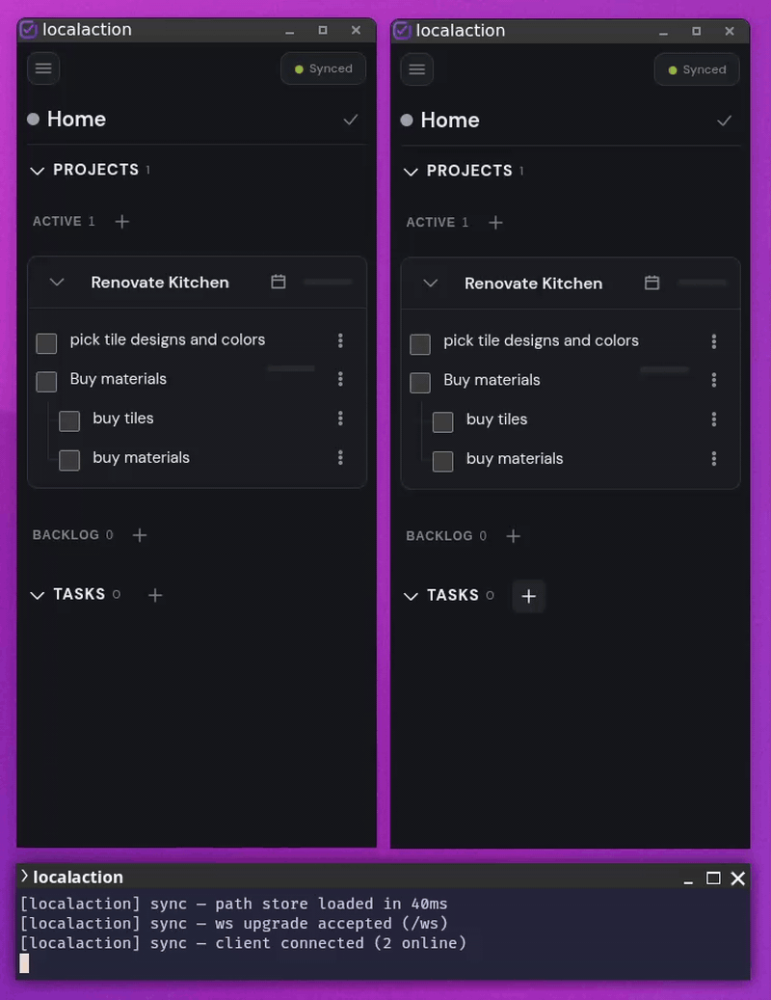

# LocalAction

**Offline-first, self-hosted task manager with multi-device sync.**



Perists work locally for offline use and syncs w/ server for automatic conflict resolution.

OPFS storage in browser, websocket sync and SQLite persistence on the server. 

Intended for multi-device use with no authorization logic.

<!-- gif loop and images -->

## Features

### UX

- **Areas** — ongoing spheres of responsibility, with recursive sub-areas as deep as you need.
- **Projects** — bounded goals inside areas, grouped Active/Backlog/Done; Done is derived from task completion, never stored.
- **Sections** — group tasks within a project.
- **Tasks** — arbitrarily nested sub-tasks.
- **Drag and Drop Trees**: reorder, nest, and unnest in one flattened drag surface.
- **Inbox / Today / Week views** with recursive open-task rollups across area subtrees.
- **Themes** (light/dark/system), five fonts, three densities; per-device view state stays out of sync.
- **Sync log** — full per-event viewer (pulls / pushes / connections) per session.

## Data sync & persistence

- **Offline-first.** The entire app runs against an in-browser store persisted to OPFS — no account, no login, works without a network.
- **Self-hosted.** The entire backend is a single Bun process — static files, WebSocket sync, and one SQLite DB file. Nothing else to deploy, and your data never leaves machines you control.
- **Multi-device sync.** Clients converge over WebSocket via CRDT-style merge (per-cell HLC timestamps, last-writer-wins) — no conflict dialogs. A sidebar badge shows sync state (Local only → Syncing… → Synced).


The client keeps all state in a [TinyBase](https://tinybase.org/) **MergeableStore** persisted to OPFS in the browser. A `WsSynchronizer` merges it with the server's authoritative SQLite copy, so edits on multiple devices converge automatically. The same sync handler serves dev and prod.

```text
Browser                        Server                            Browser
┌────────────────────┐         ┌───────────────────────────┐       ┌────────────────────┐
│ React SPA          │         │ static file server        │       │ React SPA          │
│ MergeableStore ◄───┼── /ws ──┤► sync (createWsServer)   ◄┼─ /ws ─┼──► MergeableStore  │
│ OPFS persister     │         │ persist (SQLite)          │       │ OPFS persister     │
└────────────────────┘         └───────────────────────────┘       └────────────────────┘
```

## Quick start

Requires [Bun](https://bun.sh/) (package manager *and* runtime — the server uses `bun:sqlite`).

```bash
bun install
bun run dev     # Vite dev server + sync WS (http://localhost:5173)
```

Production:

```bash
bun run build
bun pm pack
bun install -g ./localaction-<version>.tgz
localaction                  # port 7373, SQLite in the platform user-data dir
```

The installed `localaction` command is a Bun executable bundle containing the
server and built web assets. It accepts the same `--host`, `--port`, `--db`,
`--preview`, and `--help` options as `bun run prod`.

For an unreleased checkout, rebuild and replace the Bun-linked command:

```bash
bun run link:daemon
localaction
```

`link:daemon` does not require a version bump or package tarball. It runs
`bun link`, which exposes the current build at `~/.bun/bin/localaction`.
Keep `~/.bun/bin` on `PATH`; rebuilding and linking again replaces the
command with the latest checkout.

`bun run prod` and `bun run preview` remain available for source checkouts;
they accept `--host <address>`, `--port <n>`, and `--db <path>`; `--help`
prints defaults.

**NixOS:** the flake exports `packages.x86_64-linux.localaction` and
`nixosModules.default`. Import the module and enable the system service:

```nix
{
  inputs.localaction.url =
    "git+ssh://forgejo@forgejo.appz/nibblebot/localaction.git?ref=main";

  outputs = { nixpkgs, localaction, ... }: {
    nixosConfigurations.example = nixpkgs.lib.nixosSystem {
      system = "x86_64-linux";
      modules = [
        localaction.nixosModules.default
        {
          services.localaction.enable = true;
        }
      ];
    };
  };
}
```

The service binds `127.0.0.1:7373` by default and stores SQLite state at
`/var/lib/localaction/localaction.sqlite`. Set
`services.localaction.openFirewall = true` only with a non-loopback
`services.localaction.host`.

**Multi-device sync:** run `localaction` on a reachable host and point every client at that host. No auth at the moment.

## Stack & testing

- Vite 8 · React 19 (Compiler) · TypeScript · TinyBase 9 · SQLite (`bun:sqlite`) · `ws` · dnd-kit · markdown-it
- `bun test` — unit + integration suites; `bun run smoke` — WS/SQLite round-trip; Playwright e2e (`bun run test:e2e`)

## Docs

- [`docs/architecture.md`](docs/architecture.md) — client/server/sync/data model, runtime modes, testing strategy
- [`docs/ux.md`](docs/ux.md) — shell, navigation, views, appearance, interaction patterns
- [`docs/glossary.md`](docs/glossary.md) — domain vocabulary (areas, projects, sections, tasks, notes…)
- [`PRODUCT.md`](PRODUCT.md) / [`DESIGN.md`](DESIGN.md) — positioning and the visual system

## License

AGPL-3.0-or-later
