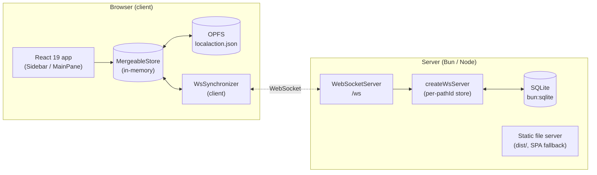
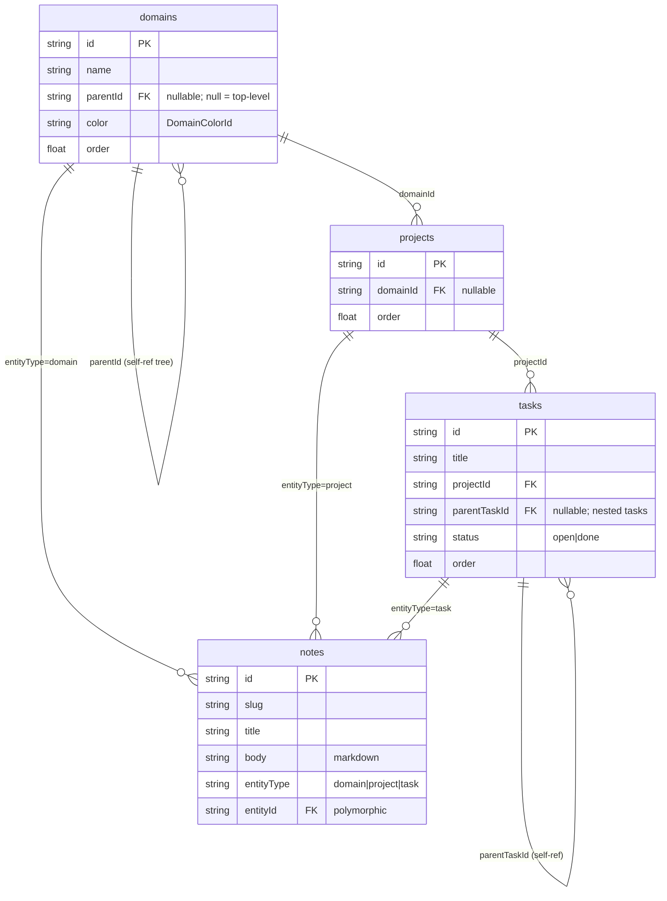
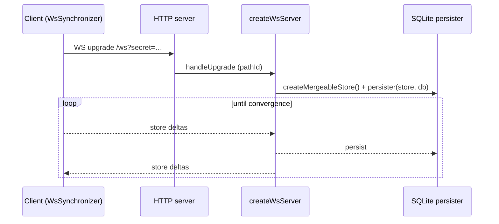

# Architecture

High-level system shape for LocalAction: client, server, sync, and data model.
For the user-facing experience, see [`ux.md`](./ux.md). For domain vocabulary,
see [`glossary.md`](./glossary.md).

## At a glance

LocalAction is a single-page React app whose state lives in an in-browser
[TinyBase](https://tinybase.org/) **MergeableStore**. The same store is
persisted locally (OPFS) **and** kept in sync over a WebSocket with a small
Node/Bun server that holds the authoritative SQLite copy. Three runtime modes —
Vite dev, Vite preview, and a compiled prod server — all share one sync handler
so behaviour never drifts between them.

## Entry chain & provider stack

`index.html` → `src/main.tsx` → `src/App.tsx` is the only entry. `main.tsx`
renders `<App />` inside `<StrictMode>` (dev-time double render — every
singleton below is engineered to survive it).

`App.tsx` wraps the tree in a fixed provider order (outer → inner):

1. `tinybase/ui-react` **`Provider store={store}`** — binds the React reconciler
   to the store so `useRow` / `useRowIds` / `useTables` subscriptions fire.
2. `AppearanceProvider` — theme / font / density (see [ux.md](./ux.md)).
3. `DataLayerProvider` — boots persistence + sync, exposes them via context.
4. `SelectionProvider` — the current hash-route selection + `navigate()`.

Inside sit the shell: `Sidebar`, `MainPane`, the dev-only TinyBase `Inspector`,
and `AppearanceMenu`.

## Data layer (`src/data/`)

The seam between React and TinyBase. Everything is re-exported from
`src/data/index.ts`; consumers never import TinyBase primitives for domain data
(except the allowed `tinybase/ui-react*` hooks and `Inspector`).

- **Store** — `store.ts` holds a process-wide `createMergeableStore()` singleton
  (`getStore()`). A MergeableStore tracks per-cell HLC timestamps, which is what
  makes conflict-free sync possible.
- **Schema** — `schema.ts` defines four tables and their column keys as `const`
  maps (`TABLES`, `COLUMNS`), plus the `TASK_STATUS` (`open` / `done`) and
  `NOTE_ENTITY_TYPE` (`domain` / `project` / `task`) enums-as-objects.
- **CRUD + hooks** — one module per entity (`domains.ts`, `projects.ts`,
  `tasks.ts`, `notes.ts`). Each exposes imperative mutators/readers
  (`createX` / `updateX` / `deleteX` / `getX`) **and** a React hook
  (`useX`) built on `tinybase/ui-react`'s `useRow` / `useRowIds`. IDs are
  `crypto.randomUUID()`; timestamps are ISO 8601.
- **Selectors** — `selectors.ts` derives rollups (`useDomainCounts`,
  `useProjectRollups`, `useNotesForDomainTree`). Each `get*` takes an optional
  `_version` dependency token so React Compiler can memoise the derived output.
- **Ordering** — `order.ts` (see [Ordering](#ordering) below).
- **Helpers** — `colors.ts` (the domain palette), `slug.ts` (note slugs),
  `internal.ts` (`newId`, `nowIso`, `row`, `useStoreVersion`).

### Data model

- **Domain** — ongoing area; self-referential (`parentId`) for one level of
  nesting (sub-domains). Carries a palette `color` and `order`.
- **Project** — bounded effort belonging to a domain; has `order`.
- **Task** — unit of action belonging to a project; self-referential
  (`parentTaskId`) for nesting; `open` / `done` status; has `order`.
- **Note** — markdown body attached to exactly one entity via the
  (`entityType`, `entityId`) pair, addressed by `slug`.

### Ordering

Drag-to-reorder is sibling-scoped. Each ordered table (`domains`, `projects`,
`tasks`) has an `order` key. `order.ts`:

- Appends new rows at `lastSiblingOrder + 1000`.
- On a drag, `computeInsertOrder` takes the midpoint between neighbours; when
  the gap drops below `MIN_GAP` the whole sibling group is **renormalised** to
  evenly-spaced integers from `RENORMALIZE_SPACING` (1000), in one transaction.
- `backfillOrder()` seeds missing `order` cells (from `idHash(id)` + timestamps)
  on boot — idempotent, run after OPFS loads.
- Reorder helpers (`reorderDomain` / `reorderProject` / `reorderTask`) move a
  row within its **current** sibling group only. Reparenting (changing
  `parentId` / `domainId` / `projectId`) is a separate `update*` mutation.

## Persistence

Two independent persisters bracket the same in-memory store:

- **Client (OPFS)** — `persistence.ts` uses
  `tinybase/persisters/persister-browser`'s `createOpfsPersister` against
  `localaction.json` in the origin's OPFS directory. On boot it `load()`s the
  snapshot, runs `backfillOrder()`, then `startAutoSave()`s. If OPFS / the File
  System Access API is unavailable, persistence is disabled (warned, non-fatal).
- **Server (SQLite)** — `server/db.ts` wraps Bun's built-in `bun:sqlite` in a
  `sqlite3#Database`-shaped adapter so TinyBase's `createSqlite3Persister`
  accepts it. The `sqlite3` npm package is a NAPI addon that aborts under a
  `bun build --compile` binary (Bun doesn't polyfill libuv on POSIX), so
  `bun:sqlite` is the only server-side sqlite path. One DB connection is shared
  process-wide.

## Sync

TinyBase's `synchronizer-ws` keeps every connected store convergent via the
HLC metadata in the MergeableStore — last-writer-wins per cell, no manual
conflict code.

- **Client** — `sync.ts` builds a `SyncClient` (a module singleton via
  `getSyncClient()`). `createWsSynchronizer(store, ws)` connects to
  `${ws|wss}://<host>/ws`. It is **StrictMode-safe**: the singleton is created
  once and is *not* destroyed on the fake unmount — only on `beforeunload`
  (`destroySyncClient`). Reconnect uses exponential backoff, 500 ms base →
  15 s cap. Status is a discriminated union surfaced through `SyncStatusBadge`.
- **Server** — `attachSyncServer` (in `server/index.ts`) creates a
  `WebSocketServer({ noServer: true })` and hands it to TinyBase's
  `createWsServer` with a persister factory: for each incoming `pathId` it makes
  a fresh `MergeableStore` + `createSqlite3Persister(store, db)` over the shared
  connection. The HTTP `upgrade` event only claims `/ws` (so Vite's HMR socket
  is left alone).
- **Secret gate** — `LOCALACTION_SYNC_SECRET` (server, env or `--secret`)
  checked against the `?secret=` query param. The client sends it from
  `VITE_LOCALACTION_SYNC_SECRET`. An empty secret = open (warned in the log).

## Server (`server/`)

One unified server serves both static assets and the sync socket:

- `createStaticFileServer(dist)` — reads files from `dist/`, with an SPA
  fallback to `index.html`, a path-traversal guard (`..` / `\0` rejected,
  `target.startsWith(root)` enforced), and a `426` short-response for `/ws`
  over plain HTTP. MIME lookup from a small allow-list; `cache-control: no-cache`.
- `attachSyncServer(httpServer, opts)` — the sync handler above. Reused by every
  runtime mode so there is one source of truth.
- `startServer(opts)` — wires static + sync onto one `http.Server` and listens.

**Three entrypoints, one handler:**

| Mode | Command | Sync wired by |
| --- | --- | --- |
| dev | `bun run dev` (`bunx --bun vite`) | `vite.config.ts` plugin → `configureServer` |
| preview | `bun run preview` | same plugin → `configurePreviewServer` |
| prod | `bun run start` (`server/index.ts`) | `startServer` directly (module `isMain`) |

Prod CLI/env precedence: `--port` > `LOCALACTION_PORT` > `5173`;
`--db` > `LOCALACTION_DB_PATH` > `./data/data.db`.

## Build & toolchain

- `bun run build` = `tsc -b` (project references: `tsconfig.app.json` for
  `src/` + `tests/`, `tsconfig.node.json` for config files) then `vite build`.
  TS errors anywhere — including config files — fail the build.
- **React Compiler** is on (`babel-plugin-react-compiler` via
  `@rolldown/plugin-babel`); code must stay compiler-clean.
- TS quirks: `verbatimModuleSyntax` (use `import type`, no default React
  import), `erasableSyntaxOnly` (no enums/namespaces), `allowImportingTsExtensions`
  (keep `.tsx` in TS import paths), `moduleResolution: bundler`.
- Everything runs under Bun; `.ts` in `scripts/` and `server/` needs no loader.

## Testing strategy

Runners split by runtime, not by name (see `bunfig.toml`):

- **vitest** (jsdom) — `tests/data/` (the full data-layer unit suite), 
  `tests/markdown/`, `tests/router.test.ts`, and any `src/**/*.test.{ts,tsx}`.
- **bun:test** (scoped to `tests/integration/`) — `sync-roundtrip.test.ts`,
  a real two-client ↔ one-server WebSocket round-trip with memory storage.
- **Playwright** (`e2e/`) — one spec per user journey; auto-starts `bun run dev`
  on 5173, depends on the `/ws` handshake.
- **`scripts/smoke.ts`** — boots the prod server on a random port and asserts
  WS sync between two clients plus a SQLite persistence round-trip.

Tests exercise the data-layer seam (typed hooks + sync protocol), never TinyBase
internals.
