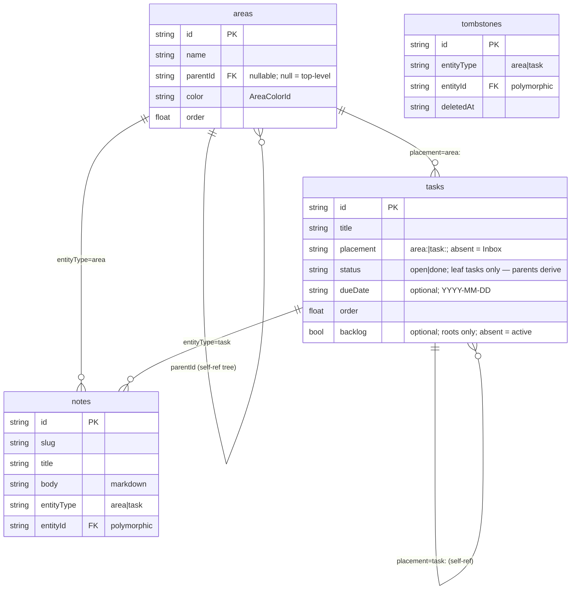
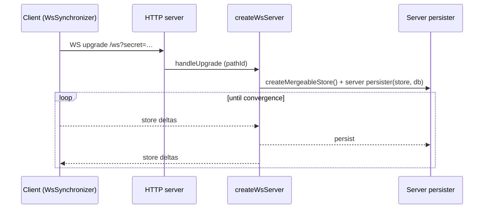

# Architecture

High-level system shape for LocalAction: client, server, sync, and data model.
For the user-facing experience, see [`ux.md`](./ux.md). For domain vocabulary,
see [`glossary.md`](./glossary.md).

## At a glance

LocalAction is a single-page React app whose state lives in an in-browser
[TinyBase](https://tinybase.org/) **MergeableStore**. The same store is
persisted locally (OPFS) **and** kept in sync over a WebSocket with a small
Bun server that holds the authoritative SQLite copy. Two runtime modes —
Vite dev and the prod server (`bun server/index.ts`) — share one sync handler
so behaviour never drifts between them.

```mermaid
  subgraph Browser["Browser (client)"]
    UI["React 19 app\n(Sidebar / MainPane)"]
    Store[("MergeableStore\n(in-memory)")]
    OPFS[("OPFS\nlocalaction.json")]
    SyncC["WsSynchronizer\n(client)"]
    UI --> Store
    Store <--> OPFS
    Store <--> SyncC
  end
  subgraph Server["Server (Bun)"]
    WS["WebSocketServer\n/ws"]
    Tiny["createWsServer\n(per-pathId store)"]
    SQLite[("SQLite\nbun:sqlite")]
    Static["Static file server\n(dist/, SPA fallback)"]
    WS --> Tiny
    Tiny <--> SQLite
  end
  SyncC <-. WebSocket .-> WS
```

## Entry chain & provider stack

`index.html` → `src/main.tsx` → `src/App.tsx` is the only entry. `main.tsx`
registers the service worker, then renders `<App />` inside `<StrictMode>`.

`App.tsx` wraps the tree in a fixed provider order (outer → inner):

1. `Provider store={store}` — binds the React reconciler to the store.
2. `AppearanceProvider` — theme / font / density (see [ux.md](./ux.md)).
3. `DataLayerProvider` — boots persistence + sync, exposes them via context.
4. `SelectionProvider` — the current hash-route selection + `navigate()`.
5. `UndoProvider` — subtree snapshots that power delete-undo.

## Data layer (`src/data/`)

The seam between React and TinyBase. One module per entity (`areas.ts`,
`tasks.ts`, `notes.ts`, `tombstones.ts`); deletes run through `deletion.ts`
(containment cascade + typed tombstones so deletions win after sync merges)
with undo snapshots in `undo.ts`. The cross-system contracts are:

- **LWW cell** — the store tracks per-cell HLC timestamps, so sync converges
  last-writer-wins per cell with no manual conflict code.
- **Atomic status + order** — status writes and order writes that belong
  together (e.g. Active ⇄ Backlog drags) happen in one transaction.
- **Idempotent boot** — `migrateProjectsToTasks` runs before `backfillOrder`;
  both are no-ops on already-current stores.

### Data model



- **Note** — markdown body attached to exactly one entity via the
  (`entityType`, `entityId`) pair, addressed by `slug`.
- **Tombstone** — typed `(entityType, entityId)` row so a deletion wins after
  a sync merge even when parent and child arrive in either order.

### Boot migration

`migrateProjectsToTasks` in `migrate.ts` folds the legacy project/section
model into the task tree at boot, before `backfillOrder`. Idempotent: an
empty legacy table is a no-op, so running it twice changes nothing.

- Each legacy project became a root task (`placement: area:<id>`, or Inbox
  when its `areaId` was null), carrying name, due date, backlog, and order.
- Sections flattened: their tasks became direct children of the new root
  (unsectioned-first, then by section order); empty projects became leaf roots.
- Project notes re-attached to the new root (`entityType: 'task'`); area
  notes untouched; project/section rows and their tombstones dropped.

### Ordering

`order.ts` gives each ordered table (`areas`, `tasks`) an `order` key; moves
write parent + order + `updatedAt` in one transaction and refuse
cycle-creating or missing-parent targets. Drag-to-reorder derives a
`(parent, before)` drop and inserts at the neighbour midpoint; when the float
gap is exhausted the sibling group renormalises to even spacing in one
transaction. `backfillOrder()` seeds missing cells on boot — idempotent, runs
after the OPFS load and migration.

## Persistence

Two independent persisters bracket the same in-memory store:

- **Client (OPFS)** — `persistence.ts` loads `localaction.json` on boot, then
  auto-saves; `DataLayerProvider` runs the boot migration then
  `backfillOrder()` once the load resolves. Unavailable OPFS is a warned
  non-fatal no-op.
- **Server (SQLite)** — `server/persister.ts` maps each store table to its own
  SQL table over one shared `bun:sqlite` connection (see `server/db.ts`).
  Because `bun:sqlite` only resolves under Bun, everything loading
  `server/db.ts` must run under Bun.

**Schema evolution** — no versioning or wipe machinery: persisted stores load
as-is, so schema changes must be backward-compatible (new tables/columns,
absent cells read as `undefined`) or a deliberate one-off load-time
transform like `migrate.ts`.

**DB separation** — dev, prod, and preview use separate default files
(`data-dev.db` / `data-prod.db` / `data-preview.db`) so dev and preview runs
never share the production store.

## Sync



- **Client** — `sync.ts` holds a StrictMode-safe `SyncClient` singleton
  connecting to `/ws`, with a bounded-retry ladder and a terminal `error`
  status the badge surfaces with a retry button.
- **Sync log** — `syncLog.ts` is a session-only, in-memory ring
  (`pull` / `push` / `sweep` / `connection`), lost on reload by design.
- **Log contract** — 1 transaction = 1 event, never persisted; internals live
  in `src/data/syncLog.ts` comments.
- **Server** — one handler, `attachSyncServer` in `server/index.ts`: a fresh
  `MergeableStore` + tabular persister per `pathId` over the shared
  connection. Every runtime mode (dev Vite plugin, prod, preview, installed
  bundle) reuses it, so sync behaviour never drifts.
- **Secret gate** — `LOCALACTION_SYNC_SECRET` checked against `?secret=`;
  empty secret = open (warned).

## Server (`server/`)

One server serves static assets (`dist/`, SPA fallback) and the `/ws` sync
socket. Entrypoints, flags, ports, DB defaults, build, and packaging: see
`AGENTS.md` and `scripts/`.

## Testing strategy

Tests exercise the data-layer seam (typed hooks + sync protocol), never
TinyBase internals. `bun test` for unit/integration, Playwright (`e2e/`) for
user journeys, `scripts/smoke.ts` for the prod boot + WS round-trip — commands
and ports per `AGENTS.md`.
