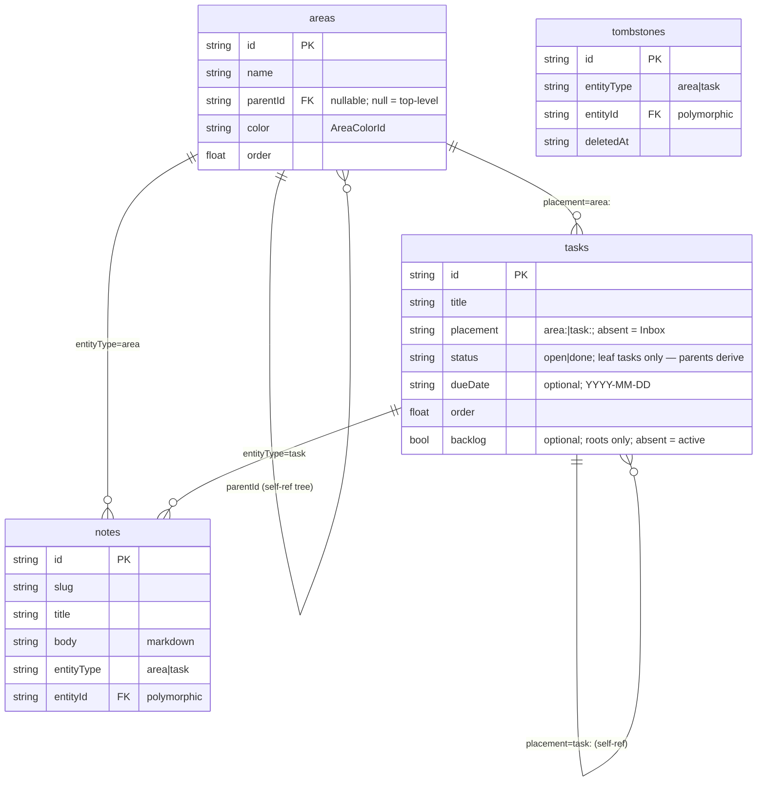
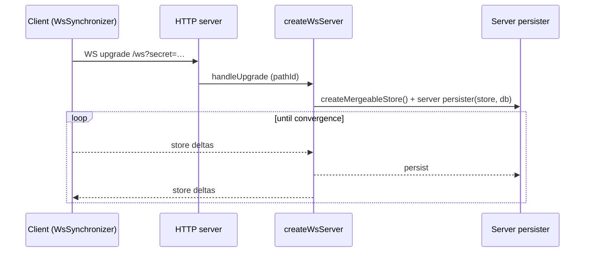

# Architecture

High-level system shape for LocalAction: client, server, sync, and data model.
For the user-facing experience, see [`ux.md`](./ux.md). For domain vocabulary,
see [`glossary.md`](./glossary.md).

## At a glance

LocalAction is a single-page React app whose state lives in an in-browser
[TinyBase](https://tinybase.org/) **MergeableStore**. The same store is
persisted locally (OPFS) **and** kept in sync over a WebSocket with a small
Bun server that holds the authoritative SQLite copy. Two runtime modes —
Vite dev and the prod server (`bun server/index.ts`) — share one sync handler
so behaviour never drifts between them.

```mermaid
  subgraph Browser["Browser (client)"]
    UI["React 19 app\n(Sidebar / MainPane)"]
    Store[("MergeableStore\n(in-memory)")]
    OPFS[("OPFS\nlocalaction.json")]
    SyncC["WsSynchronizer\n(client)"]
    UI --> Store
    Store <--> OPFS
    Store <--> SyncC
  end
  subgraph Server["Server (Bun)"]
    WS["WebSocketServer\n/ws"]
    Tiny["createWsServer\n(per-pathId store)"]
    SQLite[("SQLite\nbun:sqlite")]
    Static["Static file server\n(dist/, SPA fallback)"]
    WS --> Tiny
    Tiny <--> SQLite
  end
  SyncC <-. WebSocket .-> WS
```

## Entry chain & provider stack

`index.html` → `src/main.tsx` → `src/App.tsx` is the only entry. `main.tsx`
registers the service worker, then renders `<App />` inside `<StrictMode>`
(dev-time double render — every singleton below is engineered to survive it).

`App.tsx` wraps the tree in a fixed provider order (outer → inner):

1. `tinybase/ui-react` **`Provider store={store}`** — binds the React reconciler
   to the store so `useRow` / `useRowIds` subscriptions fire.
2. `AppearanceProvider` — theme / font / density (see [ux.md](./ux.md)).
3. `DataLayerProvider` — boots persistence + sync, exposes them via context.
4. `SelectionProvider` — the current hash-route selection + `navigate()`.
5. `UndoProvider` — subtree snapshots that power delete-undo.

Inside sit the shell: `Sidebar` (which also hosts `SyncStatusBadge` and
`AppearanceMenu`), `MainPane`, the dev-only TinyBase `Inspector`, and
`QuickAddModal`.

## Data layer (`src/data/`)

The seam between React and TinyBase. Everything is re-exported from
`src/data/index.ts`; consumers never import TinyBase primitives for entity data
(except the allowed `tinybase/ui-react*` hooks and `Inspector`).

- **Store** — `store.ts` holds a process-wide `createMergeableStore()` singleton
  (`getStore()`). A MergeableStore tracks per-cell HLC timestamps, which is what
  makes conflict-free sync possible.
- **Schema** — `schema.ts` defines four tables and their column keys as
  `const` maps (`TABLES`, `COLUMNS`), plus the `TASK_STATUS` (`open` / `done`),
  `NOTE_ENTITY_TYPE`
  (`area` / `task`), and `TOMBSTONE_ENTITY_TYPE` (the same two)
  enums-as-objects. Root tasks also carry a `backlog` cell — the only
  persistent tri-state marker; **Active** (absent cell) and **Done**
  (derived from the subtree) are never stored.
- **CRUD + hooks** — one module per entity (`areas.ts`, `tasks.ts`,
  `notes.ts`, `tombstones.ts`). Each exposes
  imperative mutators/readers (`createX` / `updateX` / `getX`) and a
  React hook (`useX`) built on `tinybase/ui-react`'s `useRow` / `useRowIds`.
  Deletes live apart — `deletion.ts` runs the containment cascade and writes
  typed tombstones (via `tombstones.ts`) so deletions win after sync merges;
  `undo.ts` captures/restores subtree snapshots for delete-undo. Notes are
  the exception: `deleteNote` stays on the entity module. IDs come from
  `crypto.randomUUID()`; timestamps are ISO 8601.
- **Selectors** — `selectors.ts` derives rollups (`useAreaCounts`,
  `useNotesForAreaTree`, `useDueItems`). Each `get*`
  takes an optional `_version` dependency token so React Compiler can memoise
  the derived output.
- **Ordering** — `order.ts` (see [Ordering](#ordering) below).
- **Migration** — `migrate.ts` runs a boot-time, idempotent one-off
  transform of legacy data into the current model (see
  [Boot migration](#boot-migration) below).
- **Helpers** — `colors.ts` (the area palette), `slug.ts` (note slugs),
  `internal.ts` (`newId`, `nowIso`, `row`, `useTableVersion`).

### Data model



- **Note** — markdown body attached to exactly one entity via the
  (`entityType`, `entityId`) pair, addressed by `slug`.
- **Tombstone** — typed `(entityType, entityId)` row written by
  `deletion.ts` so a deletion wins after a sync merge even when the
  parent and child arrive in either order.

### Boot migration

`migrate.ts` performs a one-off, idempotent upgrade of pre-cutover
stores at boot, before `backfillOrder`. The legacy model (kept here in
past tense) had **project** rows owned by areas and **section** rows
grouping a project's top-level tasks; the migration folds both into the
task tree:

- Each legacy project became a root task: `placement: area:<id>` (or
  absent = Inbox when its `areaId` was null), with name, due date,
  backlog status, and relative order copied across.
- Sections were flattened: their tasks became direct children of the new
  root, ordered unsectioned-first then by (section order, in-section
  order). An empty project became a leaf root task.
- Project notes re-attached to the new root task
  (`entityType: 'task'`); area notes were untouched. Project/section
  rows and their tombstones were dropped.

The migration is guarded by the legacy table being empty, so
post-migration stores skip it entirely; running it twice is a no-op.

### Ordering

Drag-to-reorder spans the whole tree: one flattened `SortableTree`
(dnd-kit) derives a `(parent, before)` drop from vertical position plus
horizontal (nest/unnest) intent, and the move helpers write parent +
order in one transaction. Each ordered table (`areas`, `tasks`) has an
`order` key. `order.ts`:

- The `createX` helpers (areas/tasks) append new rows
  at `lastSiblingOrder + 1000`.
- On a drag, `computeInsertOrder` takes the midpoint between neighbours
  (appending at the end lands at `last + 1000 − MIN_GAP`); when the
  float can no longer represent the gap — the midpoint coincides with a
  neighbour or the value is non-finite — the whole sibling group is
  **renormalised** to evenly-spaced integers from `RENORMALIZE_SPACING`
  (1000), in one transaction.
- `backfillOrder()` seeds missing `order` cells on `areas` and `tasks` —
  `(index + 1) * 1000 + idHash(id)`,
  sorted by `createdAt` — on boot; idempotent, run after OPFS loads.
- Move helpers (`moveArea` / `moveTask`) reorder within a sibling group AND
  (areas/tasks) reparent in a single write (parent cell + `order` +
  `updatedAt`). They refuse moves that would create a cycle (a row under
  itself or one of its own descendants) or target a missing parent.
  `moveRootToBacklog` shelves or restores a root task in one
  transaction: the `backlog` cell (set or deleted) plus repositioning
  within the root's current placement sibling group, so Active ⇄
  Backlog drags write status and order atomically. When a `moveTask`
  removes a parent's last subtask, the parent's derived status is
  snapshotted into its stored cell first, so the parent→leaf conversion
  preserves the visible state.

## Persistence

Two independent persisters bracket the same in-memory store:

- **Client (OPFS)** — `persistence.ts` uses
  `tinybase/persisters/persister-browser`'s `createOpfsPersister` against
  `localaction.json` in the origin's OPFS directory. On boot it `load()`s
  the snapshot and then `startAutoSave()`s; once the load resolves,
  `DataLayerProvider` runs the boot migration (`migrate.ts`) and then `backfillOrder()` to
  seed any missing `order` cells. If OPFS / the File System Access API is unavailable,
  persistence is disabled (warned, non-fatal).
- **Server (SQLite)** — `server/db.ts` opens a `bun:sqlite` `Database`
  (synchronous; `PRAGMA busy_timeout = 5000` on open) — the persister
  drives the `query(sql).all(...params)` shape the database already
  exposes, so no adapter layer is needed at the driver boundary.
  `server/persister.ts` builds the actual sync persister on top: a
  tabular mapping (identity: SQL table = store table, derived from
  `TABLES`) where each entity lives in its own SQL table, exposed to
  `createWsServer` as `createServerPersister` — a facade that mirrors
  the MergeableStore but loads/saves through a plain-Store bridge. On
  boot the server drops the legacy JSON-mode `tinybase` table
  (`dropLegacyJsonTable`). One DB connection is shared process-wide (see
  `server/index.ts`). Because `bun:sqlite` only resolves under the Bun
  runtime, every process that loads `server/db.ts` — prod server,
  scripts, Vite's config, tests — must run under Bun.

**Schema evolution** — there is no versioning or wipe machinery:
persisted stores (OPFS snapshot + server SQLite) load as-is on every boot.
Schema changes must therefore be backward-compatible — add tables or columns
and have readers treat absent cells as `undefined` — or be handled as a
deliberate, one-off transform at load time. The projects/sections removal
was such a transform, implemented by `migrate.ts` (see
[Boot migration](#boot-migration)).

## Sync

TinyBase's `synchronizer-ws` keeps every connected store convergent via the
HLC metadata in the MergeableStore — last-writer-wins per cell, no manual
conflict code.



- **Client** — `sync.ts` builds a `SyncClient` (a module singleton via
  `getSyncClient()`). `createWsSynchronizer(store, ws)` connects to
  `${ws|wss}://<host>/ws`. It is **StrictMode-safe**: the singleton is created
  once and is *not* destroyed on the fake unmount — only on `beforeunload`
  (`destroySyncClient`). Reconnect runs a fixed ladder — ten 1 s retries,
  then 5 s and 10 s — across 12 retries (13 tries total), then gives up
  with a terminal `error` status; the badge's retry button
  (`client.retry()`) re-arms the loop. Status is a discriminated union
  surfaced through `SyncStatusBadge`.
- **Sync log** — `syncLog.ts` keeps a session-only, in-memory ring buffer
  (~500 events) of sync activity: `pull` (inbound merges), `push` (local
  commits), `sweep` (tombstone-reconciler cascades), and `connection`
  status transitions. TinyBase persists no oplog — only per-cell HLC
  stamps — so the log is captured live, and it lives *outside* the store
  (a plain module array): writing log rows into the MergeableStore would
  sync them to peers and loop. Capture has two seams, both installed by
  `DataLayerProvider` via `installSyncLogCapture(store, log)`:
  - Pulls: the synchronizer never calls the public
    `applyMergeableChanges` — inbound diffs (the initial hash drill-down
    and live ContentDiffs alike) funnel synchronously through the store's
    internal encoded-apply slot `store.__[4]`. The wrapper counts the
    apply transaction's **net** changes (`getTransactionMergeableChanges()`
    stashed from `didFinishTransaction`, classified against pre-apply
    `hasRow`), so echo/re-applied diffs that merge to zero net changes
    never double-count.
  - Pushes: a `didFinishTransaction` listener parses
    `getTransactionMergeableChanges()`, gated by `setPushCaptureEnabled`
    (opened only after the OPFS load + migration + order backfill, so boot
    transactions never appear) and attributed to `sweep` while
    `isReconcileSweepActive()`.
  One transaction = one event — no coalescing; multi-write operations
  that should read as a single change are made atomic at the writer
  instead (`setTaskStatus` / `updateTask` wrap the `completedAt` stamp
  and the status write in one explicit transaction). The UI consumes the
  log via the badge popover and the `#/sync-log` viewer; the log is lost
  on reload by design. The pull seam also fans net-added row ids out to
  `subscribeSyncedRowAdds`, which `syncedAdds.ts` turns into TTL'd marks
  (>24-row batches dropped) that the task row reads at mount to play the
  sync-arrival entrance animation (see `docs/ux.md`).
- **Server** — `attachSyncServer` (in `server/index.ts`) creates a
  `WebSocketServer({ noServer: true })` and hands it to TinyBase's
  `createWsServer` with a persister factory: for each incoming `pathId` it
  makes a fresh `MergeableStore` + `createServerPersister(store, db)` (the
  tabular facade from `server/persister.ts`) over the shared connection.
  The HTTP `upgrade` event only claims `/ws` (so Vite's HMR socket is left
  alone).
- **Secret gate** — `LOCALACTION_SYNC_SECRET` (server env, or
  `ServerOptions.secret` for programmatic callers — the CLI has no
  `--secret` flag) checked against the `?secret=` query param. The
  client sends it from `VITE_LOCALACTION_SYNC_SECRET`. An empty secret
  = open (warned in the log).

## Server (`server/`)

One unified server serves both static assets and the sync socket:

- `createStaticFileServer(dist)` — reads files from source `dist/`, then from
  the bundled asset map in a packaged executable; a path-traversal guard (`..`
  / `\0` rejected, `target.startsWith(root)` enforced) and a `426`
  short-response for `/ws` over plain HTTP. MIME lookup comes from a small
  allow-list; `cache-control: no-cache`.
- `attachSyncServer(httpServer, opts)` — the sync handler above. Reused by every
  runtime mode so there is one source of truth.
- `startServer(opts)` — wires static + sync onto one `http.Server` and listens.

**Entrypoints, one handler:**

| Mode | Command | Sync wired by |
| --- | --- | --- |
| dev | `bun run dev` (`scripts/dev.ts` → `bun --bun vite --configLoader runner`) | `vite.config.ts` plugin → `configureServer` |
| prod | `bun run prod` (`bun server/index.ts`) | `startServer` directly (module `isMain`) |
| preview | `bun run preview` (`bun server/index.ts --preview`) | `startServer` directly (module `isMain`) |
| installed | `localaction` (`dist-bundle/localaction.js`) | `startServer` directly (module `isMain`) |

Vite runs under Bun because `vite.config.ts` statically
imports `server/index.ts` → `server/db.ts` → `bun:sqlite`. The
`--configLoader runner` flag is load-bearing in dev: Vite's default
rolldown config bundler breaks `ws` upgrade handling under Bun (the bundled
handler accepts the socket server-side but its 101 response never reaches
the wire); the native module runner skips bundling and the handshake works.

Flag precedence by mode (the server API has no built-in DB default — `ServerOptions.dbPath` is required, so programmatic callers like tests/smoke must always name a path). Dev, prod, and preview use separate default files in the platform user-data dir (`data-dev.db` / `data-prod.db` / `data-preview.db`) so dev and preview runs never share the production store; a pre-split `data.db` is left untouched:
- prod (`bun run prod`): `--port` > `7373`; `--db` > `defaultProdDbPath()` (platform user-data dir via `env-paths`, e.g. `~/.local/share/localaction/data-prod.db` on Linux).
- preview (`bun run preview`): `--port` > `7474`; `--db` > `defaultPreviewDbPath()` (`data-preview.db` in the same platform user-data dir), explicit flags win.
- dev (`bun run dev`): `scripts/dev.ts` always passes an explicit `--db` (the user's, or `defaultDevDbPath()` when absent), moved past Vite's `--` separator and read from `argv` by `vite.config.ts`; `--port` is Vite-native (the WS rides on that HTTP port).

- `bun run build` = `tsc -b` (project references: `tsconfig.app.json` for
  `src/` + `tests/`, `tsconfig.node.json` for config files and build scripts),
  then `bun --bun vite build`, then `scripts/build-localaction.ts`. The final
  step temporarily maps every Vite asset as a Bun `type: "file"` import and
  bundles `server/index.ts` plus those emitted assets into `dist-bundle/`.
  The source stub is restored before the build exits. `package.json` exposes
  that Bun-shebang bundle as the `localaction` bin, so `bun pm pack` produces
  an installable release tarball and `bun run link:daemon` registers the
  current build through Bun at `~/.bun/bin` without a version bump. TS errors
  anywhere — including config files — fail the build. A build-only Vite plugin (`localaction-sw`) then bakes a
  content-hashed precache manifest into `dist/sw.js`, which the service worker
  registered from `main.tsx` installs on first load.
- **React Compiler** is on (`babel-plugin-react-compiler` via
  `@rolldown/plugin-babel`); code must stay compiler-clean.
- TS quirks: `verbatimModuleSyntax` (use `import type`, no default React
  import), `erasableSyntaxOnly` (no enums/namespaces),
  `moduleResolution: bundler`.
- Everything app-side runs under Bun (package manager + runtime): `.ts` in
  `scripts/` and `server/` is run by `bun` directly; Vite is invoked as
  `bun --bun vite ...`. Node remains for Playwright and the tsc/oxlint
  binaries.

## Testing strategy

`bun test` drives all unit/integration suites; `bunfig.toml` sets
`[test] root = "tests"` so Bun's recursive `*.spec.ts` matching never picks
up the Playwright specs under `e2e/`.

- **bun test** — `tests/data/` (data-layer unit suite), `tests/markdown/`,
  `tests/router.test.ts`. No DOM environment: the two sync tests stub
  `globalThis.window` (`defaultEndpoint()` only reads `window.location`).
  `bun test` shares one module registry across files, so module mocks leak
  — fake through option seams (e.g. `startSync`'s `synchronizerImpl`)
  instead of `mock.module`.
- **bun test (`tests/integration/`)** — `sync-roundtrip.test.ts`: a real
  two-client ↔ one-server WebSocket round-trip against the shared
  `bun:sqlite` connection.
- **Playwright** (`e2e/`) — one spec per user journey; `bun run test:e2e`
  wraps `playwright test` (`scripts/e2e.ts`): it reaps orphaned e2e servers,
  self-installs chromium if missing, and allocates a free port per run
  (`LOCALACTION_E2E_PORT`) so parallel runs and a manual dev session never
  collide. E2e-spawned servers carry a `LOCALACTION_OWNER_PID` watchdog and
  self-terminate when the runner dies; depends on the `/ws` handshake.
- **`scripts/smoke.ts`** — boots the prod server on a random port and asserts
  WS sync between two clients plus a SQLite persistence round-trip.

Tests exercise the data-layer seam (typed hooks + sync protocol), never TinyBase
internals.
