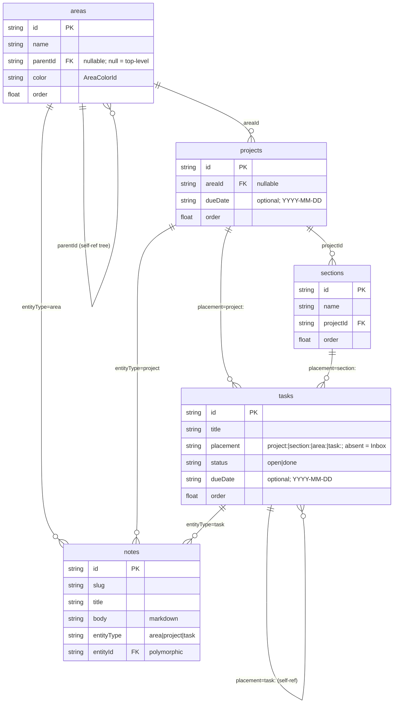
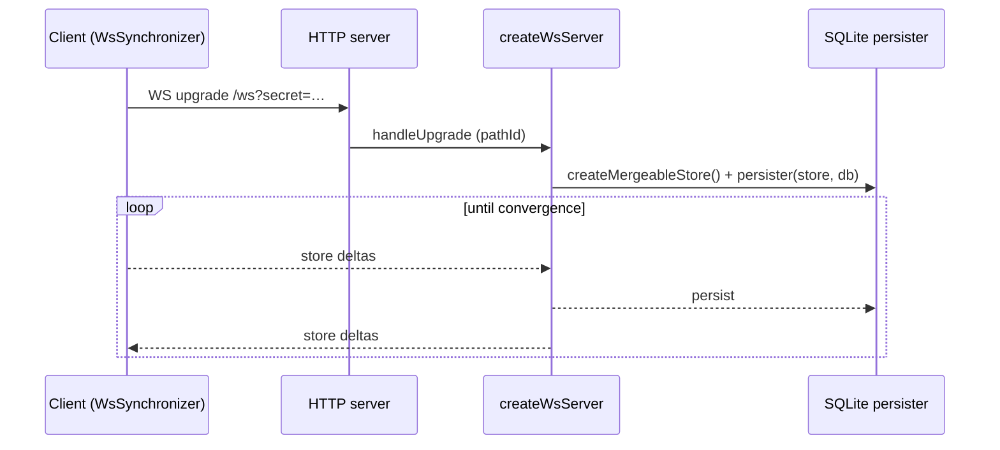

# Architecture

High-level system shape for LocalAction: client, server, sync, and data model.
For the user-facing experience, see [`ux.md`](./ux.md). For domain vocabulary,
see [`glossary.md`](./glossary.md).

## At a glance

LocalAction is a single-page React app whose state lives in an in-browser
[TinyBase](https://tinybase.org/) **MergeableStore**. The same store is
persisted locally (OPFS) **and** kept in sync over a WebSocket with a small
Node server that holds the authoritative SQLite copy. Three runtime modes —
Vite dev, Vite preview, and the prod server (`bun server/index.ts`) — all share one sync handler
so behaviour never drifts between them.

```mermaid
  subgraph Browser["Browser (client)"]
    UI["React 19 app\n(Sidebar / MainPane)"]
    Store[("MergeableStore\n(in-memory)")]
    OPFS[("OPFS\nlocalaction.json")]
    SyncC["WsSynchronizer\n(client)"]
    UI --> Store
    Store <--> OPFS
    Store <--> SyncC
  end
  subgraph Server["Server (Bun)"]
    WS["WebSocketServer\n/ws"]
    Tiny["createWsServer\n(per-pathId store)"]
    SQLite[("SQLite\nbun:sqlite")]
    Static["Static file server\n(dist/, SPA fallback)"]
    WS --> Tiny
    Tiny <--> SQLite
  end
  SyncC <-. WebSocket .-> WS
```

## Entry chain & provider stack

`index.html` → `src/main.tsx` → `src/App.tsx` is the only entry. `main.tsx`
renders `<App />` inside `<StrictMode>` (dev-time double render — every
singleton below is engineered to survive it).

`App.tsx` wraps the tree in a fixed provider order (outer → inner):

1. `tinybase/ui-react` **`Provider store={store}`** — binds the React reconciler
   to the store so `useRow` / `useRowIds` / `useTables` subscriptions fire.
2. `AppearanceProvider` — theme / font / density (see [ux.md](./ux.md)).
3. `DataLayerProvider` — boots persistence + sync, exposes them via context.
4. `SelectionProvider` — the current hash-route selection + `navigate()`.

Inside sit the shell: `Sidebar`, `MainPane`, the dev-only TinyBase `Inspector`,
and `AppearanceMenu`.

## Data layer (`src/data/`)

The seam between React and TinyBase. Everything is re-exported from
`src/data/index.ts`; consumers never import TinyBase primitives for entity data
(except the allowed `tinybase/ui-react*` hooks and `Inspector`).

- **Store** — `store.ts` holds a process-wide `createMergeableStore()` singleton
  (`getStore()`). A MergeableStore tracks per-cell HLC timestamps, which is what
  makes conflict-free sync possible.
- **Schema** — `schema.ts` defines six tables and their column keys as
  `const` maps (`TABLES`, `COLUMNS`), plus the `TASK_STATUS` (`open` / `done`),
  `NOTE_ENTITY_TYPE` (`area` / `project` / `task`), and
  `TOMBSTONE_ENTITY_TYPE` (those three + `section`) enums-as-objects.
- **CRUD + hooks** — one module per entity (`areas.ts`, `projects.ts`,
  `sections.ts`, `tasks.ts`, `notes.ts`). Each exposes
  imperative mutators/readers (`createX` / `updateX` / `deleteX` / `getX`)
  **and** a React hook (`useX`) built on `tinybase/ui-react`'s
  `useRow` / `useRowIds`. IDs are `crypto.randomUUID()`;
  timestamps are ISO 8601.
- **Selectors** — `selectors.ts` derives rollups (`useAreaCounts`,
  `useProjectRollups`, `useNotesForAreaTree`). Each `get*` takes an optional
  `_version` dependency token so React Compiler can memoise the derived output.
- **Ordering** — `order.ts` (see [Ordering](#ordering) below).
- **Helpers** — `colors.ts` (the area palette), `slug.ts` (note slugs),
  `internal.ts` (`newId`, `nowIso`, `row`, `useStoreVersion`).

### Data model



- **Note** — markdown body attached to exactly one entity via the
  (`entityType`, `entityId`) pair, addressed by `slug`.

### Ordering

Drag-to-reorder spans the whole tree: one flattened `SortableTree`
(dnd-kit) derives a `(parent, before)` drop from vertical position plus
horizontal (nest/unnest) intent, and the move helpers write parent +
order in one transaction. Each ordered table (`areas`, `projects`,
`sections`, `tasks`) has an `order` key. `order.ts`:

- Appends new rows at `lastSiblingOrder + 1000`.
- On a drag, `computeInsertOrder` takes the midpoint between neighbours; when
  the gap drops below `MIN_GAP` the whole sibling group is **renormalised** to
  evenly-spaced integers from `RENORMALIZE_SPACING` (1000), in one transaction.
- `backfillOrder()` seeds missing `order` cells (from `idHash(id)` + timestamps)
  on boot — idempotent, run after OPFS loads.
- Move helpers (`moveArea` / `moveTask` / `moveSection`) reorder within a
  sibling group AND (areas/tasks) reparent in a single write (parent cell +
  `order` + `updatedAt`). Both refuse moves that would create a cycle (a
  row under itself or one of its own descendants) or target a missing
  parent. `moveSection` and `reorderProject` stay sibling-scoped
  (sections never leave their project; projects have no tree UI).

## Persistence

Two independent persisters bracket the same in-memory store:

- **Client (OPFS)** — `persistence.ts` uses
  `tinybase/persisters/persister-browser`'s `createOpfsPersister` against
  `localaction.json` in the origin's OPFS directory. On boot it `load()`s the
  snapshot, runs `backfillOrder()`, then `startAutoSave()`s. If OPFS / the File
  System Access API is unavailable, persistence is disabled (warned, non-fatal).
- **Server (SQLite)** — `server/db.ts` opens a `bun:sqlite` `Database`
  (synchronous; `PRAGMA busy_timeout = 5000` on open) and hands it straight
  to TinyBase's `createSqliteBunPersister` — the persister drives the
  `query(sql).all(...params)` shape the database already exposes, so no
  adapter layer is needed. One DB connection is shared process-wide (see
  `server/index.ts`). Because `bun:sqlite` only resolves under the Bun
  runtime, every process that loads `server/db.ts` — prod server, scripts,
  Vite's config, tests — must run under Bun.

## Sync

TinyBase's `synchronizer-ws` keeps every connected store convergent via the
HLC metadata in the MergeableStore — last-writer-wins per cell, no manual
conflict code.



- **Client** — `sync.ts` builds a `SyncClient` (a module singleton via
  `getSyncClient()`). `createWsSynchronizer(store, ws)` connects to
  `${ws|wss}://<host>/ws`. It is **StrictMode-safe**: the singleton is created
  once and is *not* destroyed on the fake unmount — only on `beforeunload`
  (`destroySyncClient`). Reconnect uses exponential backoff, 500 ms base →
  15 s cap. Status is a discriminated union surfaced through `SyncStatusBadge`.
- **Server** — `attachSyncServer` (in `server/index.ts`) creates a
  `WebSocketServer({ noServer: true })` and hands it to TinyBase's
  `createWsServer` with a persister factory: for each incoming `pathId` it makes
  a fresh `MergeableStore` + `createSqlite3Persister(store, db)` over the shared
  connection. The HTTP `upgrade` event only claims `/ws` (so Vite's HMR socket
  is left alone).
- **Secret gate** — `LOCALACTION_SYNC_SECRET` (server, env or `--secret`)
  checked against the `?secret=` query param. The client sends it from
  `VITE_LOCALACTION_SYNC_SECRET`. An empty secret = open (warned in the log).

## Server (`server/`)

One unified server serves both static assets and the sync socket:

- `createStaticFileServer(dist)` — reads files from `dist/`, with an SPA
  fallback to `index.html`, a path-traversal guard (`..` / `\0` rejected,
  `target.startsWith(root)` enforced), and a `426` short-response for `/ws`
  over plain HTTP. MIME lookup from a small allow-list; `cache-control: no-cache`.
- `attachSyncServer(httpServer, opts)` — the sync handler above. Reused by every
  runtime mode so there is one source of truth.
- `startServer(opts)` — wires static + sync onto one `http.Server` and listens.

**Three entrypoints, one handler:**

| Mode | Command | Sync wired by |
| --- | --- | --- |
| dev | `bun run dev` (`scripts/dev.ts` → `bun --bun vite --configLoader runner`) | `vite.config.ts` plugin → `configureServer` |
| preview | `bun run preview` (`bun --bun vite preview --configLoader runner`) | same plugin → `configurePreviewServer` |
| prod | `bun run start` (`bun server/index.ts`) | `startServer` directly (module `isMain`) |

Vite runs under Bun in every mode because `vite.config.ts` statically
imports `server/index.ts` → `server/db.ts` → `bun:sqlite`. The
`--configLoader runner` flag is load-bearing in dev/preview: Vite's default
rolldown config bundler breaks `ws` upgrade handling under Bun (the bundled
handler accepts the socket server-side but its 101 response never reaches
the wire); the native module runner skips bundling and the handshake works.

Flag precedence by mode (the server API has no built-in DB default — `ServerOptions.dbPath` is required, so programmatic callers like tests/smoke must always name a path):
- prod (`bun run start`): `--port` > `5173`; `--db` > `defaultDbPath()` (platform user-data dir via `env-paths`, e.g. `~/.local/share/localaction/data.db` on Linux).
- dev (`bun run dev`): `scripts/dev.ts` always passes an explicit `--db` (the user's, or `defaultDbPath()` when absent), moved past Vite's `--` separator and read from `argv` by `vite.config.ts`; `--port` is Vite-native (the WS rides on that HTTP port).
- preview (`bun run preview`): `--db <path>` works via the `--` escape (e.g. `bun run preview -- --db X`), else `vite.config.ts` falls back to `defaultDbPath()`; `--port` is Vite-native.

## Build & toolchain

- `bun run build` = `tsc -b` (project references: `tsconfig.app.json` for
  `src/` + `tests/`, `tsconfig.node.json` for config files) then
  `bun --bun vite build`. TS errors anywhere — including config files —
  fail the build.
- **React Compiler** is on (`babel-plugin-react-compiler` via
  `@rolldown/plugin-babel`); code must stay compiler-clean.
- TS quirks: `verbatimModuleSyntax` (use `import type`, no default React
  import), `erasableSyntaxOnly` (no enums/namespaces),
  `moduleResolution: bundler`.
- Everything app-side runs under Bun (package manager + runtime): `.ts` in
  `scripts/` and `server/` is run by `bun` directly; Vite is invoked as
  `bun --bun vite ...`. Node remains for Playwright and the tsc/oxlint
  binaries.

## Testing strategy

`bun test` drives all unit/integration suites; `bunfig.toml` sets
`[test] root = "tests"` so Bun's recursive `*.spec.ts` matching never picks
up the Playwright specs under `e2e/`.

- **bun test** — `tests/data/` (data-layer unit suite), `tests/markdown/`,
  `tests/router.test.ts`. No DOM environment: the two sync tests stub
  `globalThis.window` (`defaultEndpoint()` only reads `window.location`).
  `bun test` shares one module registry across files, so module mocks leak
  — fake through option seams (e.g. `startSync`'s `synchronizerImpl`)
  instead of `mock.module`.
- **bun test (`tests/integration/`)** — `sync-roundtrip.test.ts`: a real
  two-client ↔ one-server WebSocket round-trip against the shared
  `bun:sqlite` connection.
- **Playwright** (`e2e/`) — one spec per user journey; auto-starts `bun run dev`
  on a non-default port (`5180`) so a manual `bun run dev` session on `5173` can run in parallel; depends on the `/ws` handshake.
- **`scripts/smoke.ts`** — boots the prod server on a random port and asserts
  WS sync between two clients plus a SQLite persistence round-trip.

Tests exercise the data-layer seam (typed hooks + sync protocol), never TinyBase
internals.
