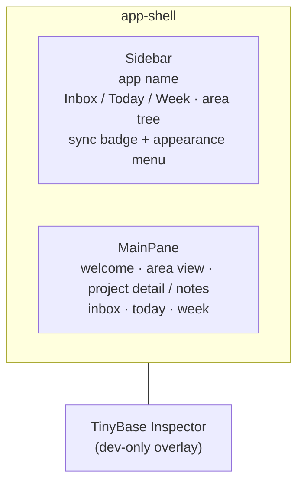

# UX

A high-level tour of the LocalAction user experience: the shell, navigation,
views, and appearance controls. For the system that powers it (store, sync,
persistence), see [`architecture.md`](./architecture.md). For terminology, see
[`glossary.md`](./glossary.md) — its *UI Structure* section names every region
referenced here (Sidebar, Main Pane, Area view, Project card, …).

## The shell

The app is a two-pane workspace:

- **Sidebar** (`Sidebar.tsx`) — the navigation column. Top to bottom: the
  app-name row, the Inbox / Today / Week quick links, the
  Areas section, and the footer holding the sync status badge and the
  appearance menu. A resizer on its trailing edge drags to set its width
  (persisted per device). Below 768px the sidebar becomes a modal drawer —
  hamburger toggle, backdrop tap or Escape to close, focus trapped while open.
  In the drawer the appearance menu presents as a bottom sheet pinned above
  the footer so every segment stays reachable at phone widths.
- **MainPane** (`MainPane.tsx`) — the working area. Renders the welcome
  screen, an area view, a project detail pane, a project-notes pane, the
  Inbox, or the Today / Week due panes, depending on the current selection.
- **Inspector** — TinyBase's `ui-react-inspector`, a dev-only overlay for
  inspecting store tables/cells.

## Navigation

There is no router library — `src/router.ts` is a tiny hash router.

- Routes: `#/` (home), `#/inbox`, `#/today`, `#/week`, `#/a/<id>` (area),
  `#/p/<id>` (project detail), `#/p/<id>/notes` (project notes).
- `SelectionProvider` holds the current `Selection` and a `navigate()` helper.
  It seeds from `window.location.hash` and listens for `hashchange`, so the
  back/forward buttons and deep links both work. `navigate()` writes the hash;
  the provider re-derives selection from it.
- Legacy task / note / tag deep links (`#/t/…`, `#/n/…`, `#/g/…`) collapse
  to **home** so stale links fall back to the welcome screen gracefully.
- **Quick add** — `Shift+A` (when no input is focused) opens a modal with a
  single field; Enter commits a new Inbox task, Esc or the backdrop cancels.

## The sidebar

### Quick links

**Inbox**, **Today**, and **Week**, each with a live count (unassociated
tasks; tasks due today; tasks due this week) and `aria-current` on the
active one.

### The area tree

Areas are top-level containers; each may hold nested **sub-areas**
(same semantics, recursively).

- Each row: colour dot, name, and the recursive open-task count across its
  subtree (descendant areas and recursive sub-tasks included). Top-level
  rows with children carry a collapse caret; the section header offers
  collapse-all / expand-all (keeping the selected area's chain expanded)
  and a new-area shortcut.
- **Drag-to-move** across the whole tree via `SortableTree` (dnd-kit's
  flattened-tree pattern — one drag context spans every level). Vertical
  movement picks the insertion row; dragging right nests the row under
  the row above, dragging left unnests it. A row's subtree always moves
  with it.
- A new-area input sits at the foot of the section; from a top-level area
  view, the header adds a sub-area.
- Selecting an area drives the MainPane's area view (and expands the row).

### Footer

- **SyncStatusBadge** — connection state: *Local only* → *Syncing…* →
  *Synced* (or *Retry #n…* / *Sync error*).
- **AppearanceMenu** — theme, font, and density controls (see
  [Appearance](#appearance)).

## MainPane views

### Welcome (home)

When nothing is selected: a centred empty state — *"Pick an area from the
sidebar to get started."* (or *"Create an area…"* when none exist).

### Area view

An `AreaHeader` above three collapsible sections — **Projects**, **Area
tasks**, **Notes** — each with a live count and a caret; section collapse
state persists per device.

The header: a breadcrumb of the parent chain (each crumb navigates), the
area name with its colour dot. Clicking the name opens an `AreaEditPopover`
— rename (commits on blur/Enter), palette swatch (commits immediately), and
delete (gated by a confirm modal the header owns, with undo). An inline
add-sub-area button sits beside the name. The header's action row holds the
**Completed toggle** (show/hide done tasks in place — device-wide, persisted).

- **Projects** — every project owned by the area and its sub-areas,
  grouped **Active** / **Backlog** / **Done**. The status groups are
  hoisted above the sub-areas: each group header renders once, and the
  area's own projects sit at the top of the group with each sub-area's
  projects as a labeled slice below them (clickable sub-area heading).
  Drag-to-reorder within a slice; dragging a project into its area's
  **Backlog** slice shelves it (a stored status) and dragging it back
  restores it; a drop that lands in another area's slice snaps back —
  drag never moves a project between areas. **Done** is derived from
  task completion and is not a drop target. The area's own Active and
  Backlog slices are both standing drop zones — visible even while
  empty, whenever the area has a project in either group; a sub-area's
  empty counterpart slice appears mid-drag, labeled by its heading.
  Group headers collapse their rows (state persisted per device).
  Each project row shows an
  expand caret, the name, a done/total progress meter, a due-date
  affordance (calendar icon, or the date once set), an empty-sections
  toggle (prunes section headers with no visible tasks from the
  expanded card; per-project, persisted per device), and a note icon
  that opens the project's notes pane. Only the
  caret expands the card in place; clicking anywhere else on the row
  (name, meter, dead space) opens the **project detail pane**. Below
  768px the row sheds its action icons (keeping caret, name, count, and
  the stateful due-date chip) so the name keeps its room and the whole
  line stays a clean open-the-pane tap target; every hidden action is
  mirrored on the detail pane. The card
  expands into one flattened drag surface spanning the
  unsectioned tasks and every section — tasks drag within/between groups
  and nest as sub-tasks; section rows (inline-renamable, deletable) drag
  to reorder, never nest, and always follow the unsectioned group. The
  card footer holds *Add task* / *Add section* inline-add buttons. A
  collapse-all / expand-all button in the section header operates on every
  card at once; per-card collapse state persists per device.
  An *Add project* button closes the section.
- **Area tasks** — the area-rooted task tree (draggable, sub-tasks nest)
  with an *Add task* button, followed by one labeled, editable group per
  sub-area that roots its own tasks (each group scoped to that
  sub-area — a root drop inside it re-parents to the sub-area).
- **Notes** — notes attached to this area or anywhere in its subtree (or
  their projects/tasks), each a line with title and markdown body preview,
  inline-editable, deletable behind a confirm. The add input creates an
  area-scoped note; project-scoped notes are created in the project notes
  pane.

The Projects, Area tasks, and Notes counts all include the full sub-area subtree.

### Inbox

The unassociated-task pane: a header with the Completed toggle, the
draggable task tree, and an add input. Quick-add (`Shift+A`) lands here.

### Today / Week

One shared `DuePane` with different ranges — Today is the single day; Week
titles itself *"Week · \<range\>"*. Open items whose due date has already
passed collect in a collapsible *Overdue* section above the range groups —
tasks render with their weekday + date label, and overdue projects render
as a single link row into their area with an *Overdue* badge; the section
and its dates are danger-tinted. Open items due in range group under
area headings (colour dot + name) and their projects. In Today, a project
whose own due date falls in range shows its link row (with a *Due today*
badge and a collapse caret) followed by its full task tree — the same
editable
`ProjectTaskList` the project detail pane uses, with sections, subtasks,
and the add-task / add-section footer. Sections with no open tasks under
them are hidden here (they still render in the area and project views). The caret hides the tree without
leaving the view; collapse state persists per device. In Week the project stays a single
link row into its area with a *Due this week* badge, and each task row
shows its weekday label. Done tasks collect in a collapsible *Done* section.
Both *Overdue* and *Done* collapse from their header rows; collapse state
persists per device, keyed independently per view. Empty state: *"Nothing in this view."*

### Project detail pane

Clicking a project row (`#/p/<id>`) opens the standalone form of an
expanded project card: the project header (area breadcrumb, Completed
toggle) carries the same actions the card's row
shows — the done/total progress meter, the due-date affordance, the
empty-sections toggle (per-project state shared with the card), the
note icon, rename, and delete (which returns to the owning area) —
above the same sectioned task tree the card expands into, with
*Add task* / *Add section* inline-add buttons.

### Project notes pane

The note icon on a project row (`#/p/<id>/notes`) opens a notes-only pane: a
project header with a breadcrumb back to its area, and the project's notes
with an add input. This is the only place project-scoped notes are created —
the area view's Notes section rolls them up for display only.

## Notes & markdown

A **Note** is a markdown body attached to exactly one entity (area, project,
or task). Rendering goes through `src/markdown/render.ts` (`markdown-it`), a
CommonMark subset. Notably, `[[double-brackets]]` are **not** turned into links
— they render as literal text — and code spans are left alone. Each note is
addressed by a URL-safe **slug** derived from its title.

## Appearance

`AppearanceProvider` controls three dimensions, each applied as a `data-*`
attribute on the document root and persisted to `localStorage`
(`localaction.appearance.v1`). The controls live in the sidebar footer's
appearance menu:

| Dimension | Attribute | Options |
| --- | --- | --- |
| Theme | `data-la-theme` | `light` · `dark` · `system` |
| Font | `data-la-font` | `jakarta` · `plex` · `general` · `manrope` · `dm` |
| Density | `data-la-density` | `compact` · `normal` · `cozy` |

- `system` theme resolves against the OS `prefers-color-scheme` media query
  (`useResolvedTheme` subscribes to changes).
- Styling is token-driven: `src/index.css` defines the design tokens (surfaces,
  borders, text, the purple accent) as CSS custom properties keyed off those
  `data-*` attributes (light/dark, density, fonts). `src/App.css` holds the
  shell + component-scoped rules (`.app-shell`, `.sidebar*`, `.main*`,
  `.modal*`, `.sortable-*`, `.appearance-*`).

## Interaction patterns

- **`SortableList`** — the shared drag-to-reorder surface (dnd-kit) with a drag
  handle; used for flat sibling lists (project rows).
- **`SortableTree`** — the flattened-tree drag surface (dnd-kit) for the
  sidebar area tree and task trees; vertical position + horizontal
  nest/unnest intent resolve to a reparenting move. A per-row `maxDepthOf`
  override pins certain rows to a fixed level (project section rows can
  never nest).
- **`InlineAddInput` / `InlineAddButton`** — the add affordances everywhere:
  new area, project, task, section, or note.
- **`EditableTitle`** — inline rename of an entity's title (section names).
- **Popovers** — `AreaEditPopover` (rename / recolour / delete an area) and
  the due-date pickers behind the task / project due-date buttons.
- **`ConfirmModal`** — confirmation for destructive actions (delete).
- **`UndoToast`** — completing a task offers a timed undo.
- **`QuickAddModal`** — global `Shift+A` quick-add to the Inbox.
- **Device-local view state** — collapse sets, the Completed toggle, the
  sidebar width, and appearance all persist to `localStorage` and never
  sync: they are per-screen preferences, not data.

## Colour system

Areas carry a palette colour (`src/data/colors.ts`, `AREA_COLORS`): purple,
blue, green, pink, amber, gray. The chosen id is stored on the area and
rendered as its sidebar dot / header marker; an unknown id falls back to gray.
