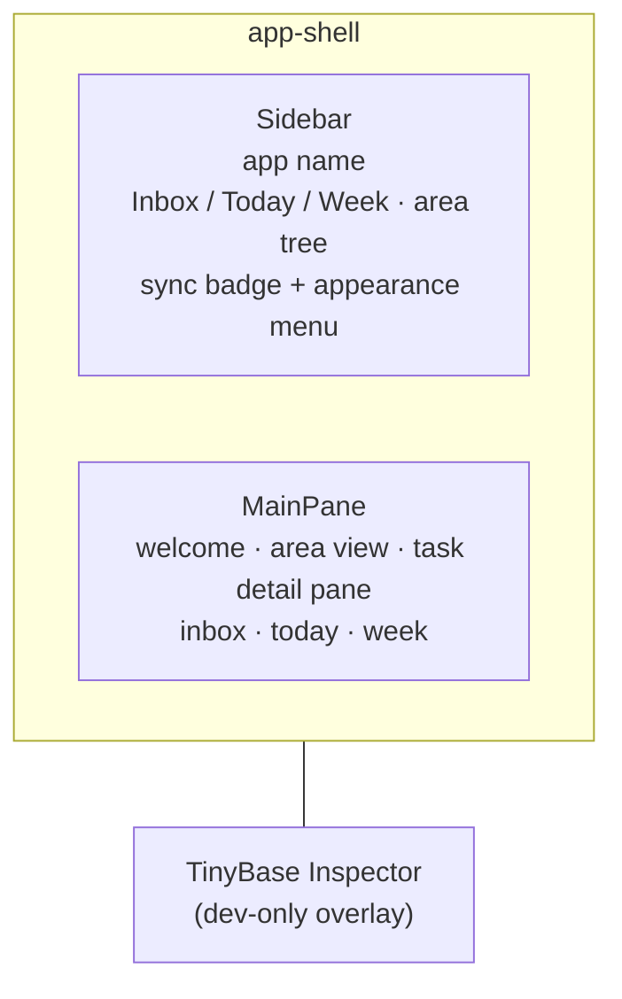

# UX

A high-level tour of the LocalAction user experience: the shell, navigation,
views, and appearance controls. For the system that powers it (store, sync,
persistence), see [`architecture.md`](./architecture.md). For terminology, see
[`glossary.md`](./glossary.md) — its *UI Structure* section names every region
referenced here (Sidebar, Main Pane, Area view, Task detail pane, …).

## The shell

The app is a two-pane workspace:

- **Sidebar** (`sidebar/Sidebar.tsx`) — the navigation column. Top to bottom: the
  app-name row, the Inbox / Today / Week quick links, the
  Areas section, and the footer holding the sync status badge and the
  appearance menu. A resizer on its trailing edge drags to set its width
  (persisted per device). Below 768px the sidebar becomes a modal drawer —
  hamburger toggle, backdrop tap or Escape to close, focus trapped while open;
  the sync status badge moves to a fixed top-right slot.
  In the drawer the appearance menu presents as a bottom sheet pinned above
  the footer so every segment stays reachable at phone widths.
- **MainPane** (`MainPane.tsx`) — the working area. Renders the welcome
  screen, an area view, a task detail pane, the
  Inbox, or the Today / Week due panes, depending on the current selection.
- **Inspector** — TinyBase's `ui-react-inspector`, a dev-only overlay for
  inspecting store tables/cells.

## Navigation

There is no router library — `src/router.ts` is a tiny hash router.

- Routes: `#/` (home), `#/inbox`, `#/today`, `#/week`, `#/a/<id>` (area),
  `#/t/<id>` (task detail pane).
- `SelectionProvider` holds the current `Selection` and a `navigate()` helper.
  It seeds from `window.location.hash` and listens for `hashchange`, so the
  back/forward buttons and deep links both work. `navigate()` writes the hash;
  the provider re-derives selection from it.
- Legacy deep links (`#/n/…`, `#/g/…`, `#/p/…`) collapse
  to **home** so stale links fall back to the welcome screen gracefully.
- **Quick add** — `Shift+A` (when no input is focused) opens a modal with a
  single field; Enter commits a new Inbox task, Esc or the backdrop cancels.

## The sidebar

### Quick links

**Inbox**, **Today**, and **Week**, each with a live count (unassociated
tasks; open tasks due today; open tasks due this week) and `aria-current` on the
active one.

### The area tree

Areas are top-level containers; each may hold nested **sub-areas**
(same semantics, recursively).

- Each row: colour dot, name, and the recursive open-task count across its
  subtree (descendant areas and recursive sub-tasks included). Areas never
  collapse — the tree is always fully expanded, so the selected area is
  always visible with its whole subarea subtree; the section header offers
  a new-area shortcut.
- **Drag-to-move** across the whole tree via `SortableTree` (dnd-kit's
  flattened-tree pattern — one drag context spans every level). Vertical
  movement picks the insertion row; dragging right nests the row under
  the row above, dragging left unnests it. A row's subtree always moves
  with it.
- A new-area input sits at the foot of the section; from an area view,
  the header adds a sub-area.
- Selecting an area drives the MainPane's area view (and expands the row).

### Footer

- **SyncStatusBadge** — a quiet connectivity label: *Local only* →
  *Connecting…* → *Synced* (or *Syncing…* while online with unsent
  changes; *Offline* while reconnecting or after the reconnect loop
  gives up). Freshness and failure live in the dot — grey = synced,
  blinking orange = unsynced changes, red = sync failure — with retry
  details in the tooltip. The badge is a toggle: clicking
  it opens the sync-activity popover — the recent pull/push/connection
  events (*"Pulled 8 Tasks, 1 Area"*, *"Pushed 2 Tasks"*,
  *"Connected 234ms"* — time-to-connect: ms under a second, seconds
  with one decimal above) with relative times
  and an *"Open full sync log"* link to the `#/sync-log` viewer. A
  reconnect burst (a server blip's chain of Connecting/Retry events)
  collapses into a single episode row — *"Reconnected after 2 retries
  (1.2s)"* — while the full viewer below keeps every raw event (absolute
  timestamps, per-table added/updated/removed breakdowns, raw event JSON,
  copy/clear actions).
  Below 768px a second badge instance pins to the shell's top-right corner
  so sync state stays visible while the sidebar is a closed drawer.
- **AppearanceMenu** — theme, font, and density controls (see
  [Appearance](#appearance)).

## MainPane views

### Welcome (home)

When nothing is selected: a centred empty state — *"Pick an area from the
sidebar to get started."* (or *"Create an area…"* when none exist).

### Area view

An `AreaHeader` above two collapsible sections — the **task groups** and
**Notes** — each with a live count and a caret; section collapse state
persists per device.

The header: a `..` link back to the parent area followed by a `/` separator
(shown only when the area has a parent), the area name with its colour dot.
Clicking the name opens an `AreaEditPopover` — rename (commits on blur/Enter),
palette swatch (commits immediately), and delete (gated by a confirm modal
the header owns, with undo). An inline add-sub-area button sits beside the
name.

- **Task groups** — one unified list of the area's **root tasks**, grouped
  **Active** / **Backlog** / **Done**. The groups are hoisted above the
  sub-areas: each group header renders once, and the area's own roots sit
  at the top of the group with each sub-area's roots as a labeled slice
  below them (clickable sub-area heading). Every Active or Backlog root
  renders its **entire subtree inline** — completed subtasks stay visible
  in place, checked and struck through — with a caret to collapse it.
  Parent rows show a done/total progress meter in place of a checkbox;
  leaf rows keep the checkbox. Only the caret expands a subtree in place;
  clicking a parent's name (or row body) opens the **task detail pane**.
  Group headers collapse their rows; group collapse state persists per
  device.
  - **Active** is the default group; the add-task "+" opens a draft row
    here (the task exists only once the draft's title commits — Enter, or
    blur with a non-empty title; Escape or an empty blur creates nothing).
  - **Backlog** is a standing drop zone — it renders on every area view,
    even while the area has no shelved tasks at all, so shelving a root is
    always a visible drag away.
  - **Done** is derived (every descendant done) and static; it is never a
    drop target.
- **Notes** — notes attached to this area or anywhere in its subtree (its
  own notes plus the subtree's task notes), each a line with title and
  markdown body preview, inline-editable, deletable behind a confirm. The
  add input creates an area-scoped note; a task's note is created and
  edited in its detail pane.

The task-group and Notes counts both include the full sub-area subtree.

### Inbox

The unassociated-task pane: the same three root-task groups as the area
view — **Active** / **Backlog** / **Done** — with no sub-area slices,
followed by an add input. Quick-add (`Shift+A`) lands here.

### Today / Week

One shared `DuePane` with different ranges — Today is the single day; Week
titles itself *"Week · \<range\>"*. Open items whose due date has already
passed collect in a collapsible *Overdue* section above the range groups —
its items group under the same area headings (colour dot + name, Inbox
first) as in-range items and every overdue row carries its actual weekday +
date label, not a generic badge; the section is danger-tinted. When
overdue and in-range items both exist, a divider line separates the
*Overdue* section from the range groups; it stays in place while *Overdue*
is collapsed and is absent when nothing remains in range. Open items due
in range group under area headings (colour
dot + name), each row labeled with its owning root task's title. In Today,
a root task whose own due date falls in range expands into its full
editable task tree in place — the same tree the task detail pane renders,
with subtasks and the same add-task "+" affordances — which supersedes its
read-only rows. The caret hides the tree without leaving the view;
collapse state persists per device. In Week, items due in range instead
group under collapsible per-day sections (ascending, weekday + date
headers), each day's count in a badge, with its items grouped under the
area headings as before and the day sections' collapse state persisted
independently. There a due root task stays a single link row into its area
with a *Due this week* badge; rows inside a day section carry no
individual weekday label, since the day header carries the date. Done
tasks collect in a collapsible *Done* section. Both *Overdue* and *Done*
collapse from their header rows; collapse state persists per device,
keyed independently per view. Empty state: *"Nothing in this view."*

### Task detail pane

Clicking a parent task's name (`#/t/<id>`) opens its detail pane: a header
with the task name (inline-renamable), the due-date affordance, a
breadcrumb / back affordance toward the owning root or parent pane, and
delete (which returns to the owning view). For a **root** task the header
also carries the **Backlog** toggle — shelving or restoring the root and
its whole subtree in one move. The body renders the task's full subtree
with the same row chrome as the area view (parent rows show their
done/total progress meter; leaves their checkbox), plus the task's **note
body** — a markdown editor scoped to this task, the only place a
task-scoped note is created. The pane works at any depth: clicking a
nested subtask's name navigates to its own pane, and the back affordance
returns toward the parent. Leaf tasks have no pane — their name edits in
place in the tree.

## Notes & markdown

A **Note** is a markdown body attached to exactly one entity (area or
task). Rendering goes through `src/markdown/render.ts` (`markdown-it`),
CommonMark-based with raw HTML disabled and bare URLs autolinked. Notably,
`[[double-brackets]]` are **not** turned into links
— they render as literal text — and code spans are left alone. Each note
carries a unique, URL-safe **slug** derived from its title.

## Drag & drop

One flattened `SortableTree` (dnd-kit) drag surface spans each task tree.
Within a rendered view:

- **Re-parenting both ways** — dragging a root onto a row nests it as a
  subtask; dragging a subtask out to top level roots it. Horizontal
  (nest/unnest) intent plus vertical position resolve to the
  `(parent, before)` move.
- **Slice-drop changes ownership** — dropping a root into a sub-area's
  slice writes `placement: area:<subAreaId>`, re-owning it to that
  sub-area.
- **Backlog-drop shelves** — dropping a root onto the Backlog group calls
  `moveRootToBacklog`, writing the backlog status and the new sibling
  position in one transaction (cross-group Active ⇄ Backlog drags are
  atomic).
- **Done is never a drop target** — the Done group rejects drops.
- **No Inbox ↔ area drag** — the Inbox pane and area view share no drag
  surface; moving a task between them happens through the task detail
  pane.

## Interaction patterns

- **`SortableTree`** — the flattened-tree drag surface (dnd-kit) for the
  sidebar area tree and task trees; vertical position + horizontal
  nest/unnest intent resolve to a reparenting move.
- **`InlineAddInput` / `InlineAddButton`** — the add affordances everywhere:
  new area, task, or note. In the task add fields (inbox and area Active
  / Backlog group footers), Shift+Enter commits and keeps the field open
  for the next task (quick entry, mirroring the task-tree draft row).
- **`EditableTitle`** — inline rename of an entity's title.
- **Popovers** — `AreaEditPopover` (rename / recolour / delete an area) and
  the due-date pickers behind the task due-date buttons.
- **`ConfirmModal`** — confirmation for destructive actions (delete).
- **`UndoToast`** — completing a task offers a timed undo.
- **Sync-arrival entrance** — a task row that arrives via a sync pull
  (another device's write) enters with `task-line-synced-in`: the list
  makes room (`max-height` + opacity, ~320ms) while the background
  flashes a theme-aware tint (darker in light mode, lighter in dark) that
  fades out over ~1s. Local adds never animate; bulk initial syncs
  (>24 rows) skip it; `prefers-reduced-motion` renders the row instantly.
- **`QuickAddModal`** — global `Shift+A` quick-add to the Inbox.
- **Device-local view state** — collapse sets, the sidebar width, and
  appearance all persist to `localStorage` and never sync: they are
  per-screen preferences, not data.

## Appearance

`AppearanceProvider` controls three dimensions, each applied as a `data-*`
attribute on the document root and persisted to `localStorage`
(`localaction.appearance.v1`). The controls live in the sidebar footer's
appearance menu:

| Dimension | Attribute | Options |
| --- | --- | --- |
| Theme | `data-la-theme` | `light` · `dark` · `system` |
| Font | `data-la-font` | `jakarta` · `plex` · `general` · `manrope` · `dm` |
| Density | `data-la-density` | `compact` · `normal` · `cozy` |

- `system` theme resolves against the OS `prefers-color-scheme` media query
  (`useResolvedTheme` subscribes to changes).
- Styling is token-driven: `src/index.css` defines the design tokens (surfaces,
  borders, text, the purple accent) as CSS custom properties keyed off those
  `data-*` attributes (light/dark, density, fonts). `src/App.css` holds the
  shell + component-scoped rules (`.app-shell`, `.sidebar*`, `.main*`,
  `.modal*`, `.sortable-*`, `.appearance-*`).

## Colour system

Areas carry a palette colour (`src/data/colors.ts`, `AREA_COLORS`): purple,
blue, green, pink, amber, gray. The chosen id is stored on the area and
rendered as its sidebar dot / header marker; an unknown id falls back to gray.