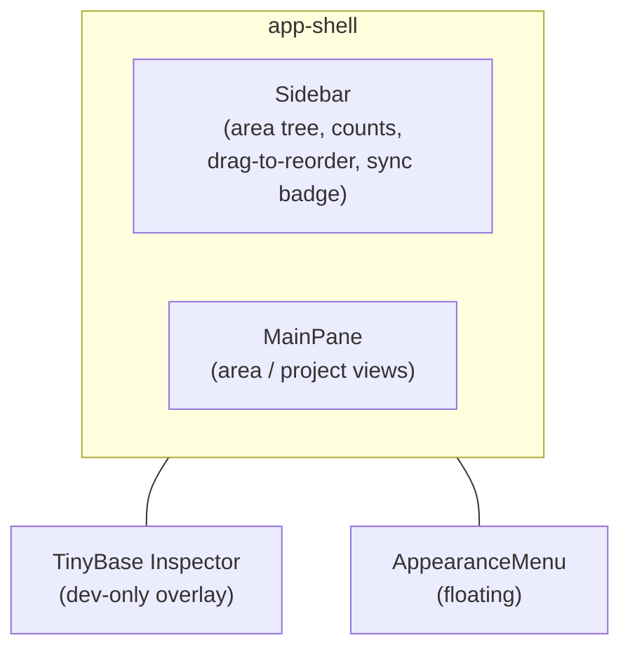

# UX

A high-level tour of the LocalAction user experience: the shell, navigation,
views, and appearance controls. For the system that powers it (store, sync,
persistence), see [`architecture.md`](./architecture.md). For terminology, see
[`glossary.md`](./glossary.md).

## The shell

The app is a two-pane workspace:

- **Sidebar** (`Sidebar.tsx`) — the area tree, the primary way to navigate.
  Each row shows a coloured dot, the area name, and the total number of tasks
  across that area tree, including tasks in descendant areas and recursive sub-tasks.
  A `SyncStatusBadge` at the foot reports connection state: *Local only* →
  *Syncing…* → *Synced* (or *Retry #n…* / *Sync error*).
- **MainPane** (`MainPane.tsx`) — the working area. Renders an area view, a
  project view, or the welcome screen depending on the current selection.
- **Inspector** — TinyBase's `ui-react-inspector`, a dev-only overlay for
  inspecting store tables/cells.
- **AppearanceMenu** — floating controls for theme, font, and density.

## Navigation

There is no router library — `src/router.ts` is a tiny hash router.

- Routes: `#/` (home), `#/a/<id>` (area), `#/p/<id>` (project).
- `SelectionProvider` holds the current `Selection` and a `navigate()` helper.
  It seeds from `window.location.hash` and listens for `hashchange`, so the
  back/forward buttons and deep links both work. `navigate()` writes the hash;
  the provider re-derives selection from it.
- Legacy task / note / tag deep links (`#/t/…`, `#/n/…`, `#/g/…`) collapse to
  **home** so stale links fall back to the welcome screen gracefully.

## The area tree (sidebar)

Areas are top-level containers; each may hold one level of **sub-areas**
(same semantics, nested under a parent).

- Each row: colour dot, name, counts.
- **Drag-to-move** across the whole tree via `SortableTree` (dnd-kit's
  flattened-tree pattern — one drag context spans every level). Vertical
  movement picks the insertion row; dragging right nests the row under
  the row above, dragging left unnests it. Nesting is clamped to one
  level of sub-areas; a row's subtree always moves with it.
- Add a top-level area or, from a top-level area view, add a sub-area.
- Selecting an area drives the MainPane's area view.

## MainPane views

### Welcome (home)

When nothing is selected: a centred empty state — *"Pick an area from the
sidebar to get started, or create a new one."*

### Area view

A `AreaHeader` (name, colour, and a breadcrumb of the parent chain) sits above
three **tabs**, each carrying a live count and an add action:

- **Projects** — project rows with a done/total rollup; drag-to-reorder within
  the area.
- **Tasks** — tasks grouped by their project, with nested sub-tasks, an
  open/done toggle, and drag-to-reorder.
- **Notes** — notes attached to this area (or its projects/tasks), each shown
  as a line with a markdown body preview.

Tabs remember their last selection per area.

### Project view

Selecting a project (`#/p/<id>`) opens `ProjectPane`: a project header with a
breadcrumb back to its area, and two tabs:

- **Tasks** — the project's task tree (nested tasks, status toggle, reorder).
- **Notes** — notes attached to this project.

## Notes & markdown

A **Note** is a markdown body attached to exactly one entity (area, project,
or task). Rendering goes through `src/markdown/render.ts` (`markdown-it`), a
CommonMark subset. Notably, `[[double-brackets]]` are **not** turned into links
— they render as literal text — and code spans are left alone. Each note is
addressed by a URL-safe **slug** derived from its title.

## Appearance

`AppearanceProvider` controls three dimensions, each applied as a `data-*`
attribute on the document root and persisted to `localStorage`
(`localaction.appearance.v1`):

| Dimension | Attribute | Options |
| --- | --- | --- |
| Theme | `data-la-theme` | `light` · `dark` · `system` |
| Font | `data-la-font` | `inter` · `dejavu` · `liberation` |
| Density | `data-la-density` | `compact` · `normal` · `cozy` |

- `system` theme resolves against the OS `prefers-color-scheme` media query
  (`useResolvedTheme` subscribes to changes).
- Styling is token-driven: `src/index.css` defines the design tokens (surfaces,
  borders, text, the purple accent) as CSS custom properties keyed off those
  `data-*` attributes (light/dark, density, fonts). `src/App.css` holds the
  shell + component-scoped rules (`.app-shell`, `.sidebar*`, `.main*`,
  `.modal*`, `.sortable-*`, `.appearance-*`).

## Interaction patterns

- **`SortableList`** — the shared drag-to-reorder surface (dnd-kit) with a drag
  handle; used for flat sibling lists (project rows).
- **`SortableTree`** — the flattened-tree drag surface (dnd-kit) for the
  sidebar area tree and task trees; vertical position + horizontal
  nest/unnest intent resolve to a reparenting move.
- **`PromptModal`** — modal used for create flows (new area / project / task /
  note).
- **`ConfirmModal` / `ConfirmButton`** — confirmation for destructive actions
  (delete).
- **`EditableTitle`** — inline rename of an entity's title.

## Colour system

Areas carry a palette colour (`src/data/colors.ts`, `AREA_COLORS`): purple,
blue, green, pink, amber, gray. The chosen id is stored on the area and
rendered as its sidebar dot / header marker; an unknown id falls back to gray.
